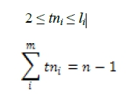
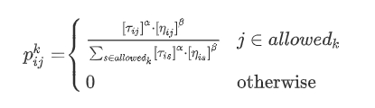
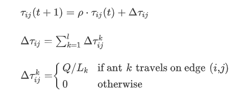

# Logistic Routing Problem


## Tujuan Tugas
1. Review materi pathfinding pada mata kuliah Strategi Algoritma.
2. Mengenal multiple-agent TSP.
3. Melakukan visualisasi data.

## Deskripsi Masalah
Welcome to **Oldenburg** ! Kota kecil cantik ini merupakan sebuah kota kecil di barat lau kota Bremen , Jerman , dengan penduduk kurang lebih 168 ribu jiwa [2018]. Kota kecil ini cocok menjadi lahan uji coba untuk melakukan pemodelan sederhana pembuatan rute pengantaran logistik.<br>
Setiap beberapa jam sekali, sebuah perusahaan logistik akan mengirimkan beberapa kurirnya untuk mengantar barang dari kantor pusat mereka ke beberapa titik tujuan yang tersebar di penjuru kota Oldenburg. Anda diminta untuk mencari rute untuk seluruh kurir sehingga jarak yang ditempuh oleh semua kurir paling kecil, sehingga perusahaan logistik dapat menghemat biaya bensin.

## Multiple-Agent TSP
Masalah pengantaran barang untuk satu kendaraan dengan fungsi objektif jarak minimal dapat dimodelkan oleh Travelling Salesman Problem. Akan tetapi, perusahaan logistik biasanya memiliki lebih dari satu kendaraan yang berangkat bersamaan, sehingga TSP kurang cocok digunakan. Generalisasi TSP untuk beberapa agen adalah **multiple-agent TSP (mTSP)**, dan model masalah ini akan kita gunakan. Pada mTSP, akan terdapat *m* tur yang akan dibangun. Syarat dari semua tur mirip dengan TSP, yaitu bahwa seluruh tur akan kembali ke simpul awal (mewakili kantor pusat) dan setiap tujuan hanya akan dilewati oleh satu tur.

## Pathfinding
Pada permasalahan Logistic Routing Problem ini, pathfinding digunakan untuk mencari rute terpendek antara titik-titik yang dicantumkan dalam pembangunan upagraf. Dalam mencari rute optimal dari suatu titik ke titik lain, pada program ini author menggunakan pendekatan dengan algoritma A*. Algoritma A* merupakan pengembangan dari algoritma Djikstra. Algoritma A* mengevaluasi cost dari suatu titik dengan menjumlahkan jarak yang telah dilalui untuk menuju titik tersebut dengan menerapkan heuristik, yaitu perkiraan jarak yang diperlukan untuk menuju titik tujuan. Cost yang telah dievaluasi akan disimpan dalam suatu container (list/array, priority queue, dll) dan pada setiap iterasi akan dipilih node dengan cost terendah dan akan terus berulang sampai ditemukan solusi. Perilaku evaluasi di diformulasikan menjadi f(n) = g(n) + h(n).
f(n) = Total cost dari suatu titik
g(n) = Total jarak yang telah dilalui dari titik awal menuju titik n
h(n) = Perkiraan jarak dari titik n menuju titik tujuan

Dalam program ini, fungsi h(n) didefinisikan sebagai jarak euclidian dari titik n ke titik tujuan.

## Multiple Traveling Salesman Problem (mTSP)
Untuk mencari solusi bagi permasalahan mTSP pada program ini, author melakukan pendekatan dengan memanfaatkan algoritma Ant Colony Optimization. Ant Colony Optimization (ACO) merupakan salah satu jenis pengembangan paradigma yang digunakan untuk menyelesaikan masalah optimasi yang terinspirasi oleh perilaku kkumpulan serangga. ACO adalah teknik probabilitas berdasarkan perilaku semut dalam mencari makanan. Dalam mencari makanan, semut akan meninggalkan pheromone pada jalur yang dilaluinya yang bertindak sebagai suatu sinyal bagi semut lain. Semakin besar tingkat pheromone pada suatu jalur, semakin besar kemungkinan semut lain akan memilih jalur tersebut dan akan semakin memperkuat pheromone di jalur tersebut. Umumnya jalur tersebut merupakan jalur terpendek.

Pada mTSP dengan pendekatan ACO pada Logistic Routing Problem, akan terdapat sejumlah iterasi. Di setiap iterasi, jumlah semut merupakan jumlah salesman. Setiap semut dapat mengunjungi sejumlah kota dengan batasan berikut:
<br>

<br>
tni         : jumlah node yang dikunjungi semut i
li          : maksimal jumlah node yang dapat dikunjungi semut i
m           : jumlah salesman
n           : jumlah titik
Pada program ini, author menetapkan minimal satu salesman mengunjungi 2 node selain node awal supaya terbentuk sirkuit hamilton.
Semut pertama akan menyelusuri jalur terlebih dahulu. Dalam menentukan node mana yang akan dikunjungi untuk menentukan jalur, akan digunakan rumus berikut untuk menentukan probabilitas mengunjungi setiap node yang bertetangga dan dapat dikunjungi dari node yang sekarang ditempati:
<br>

<br>
τij         : tingkatpheromone antara node i dan j
ηij         : visibilitas dari i terhadap node j
α           : parameter tingkat influence dari τ
β           : parameter tingkat influence dari η
allowedk    : node yang belum dikunjungi

Tiap hasil probabilitas akan disimpan dalam suatu list dan akan dipilih satu titik dengan menggunakan roulette wheel. Lalu, semut akan meng-update feromon pada edge tersebut dengan menggunakan rumus berikut ini
<br>

<br>
τij(t)      : Intensitas pheromone pada iterasi ke-t
ρ           : Parameter evaporasi feromon [0, 1] 
Δτij        : Total Penambahan intensitas pheromone suatu edge saat suatu iterasi
Δτijk       : Penambahan pheromone suatu edge yang disebabkan semut k

Pada akhir setiap iterasi, delta pheromon akan ditambahkan ke global pheromon yang telah tersedia. Hal ini akan terus berulang sampai semut kembali ke titik awal. Setelah suatu semut kembali ke titik awal, semut-semut berikutnya akan menyelusuri jalur dengan node-node yang belum dikunjungi oleh semut-semut sebelumnya. Tiap iterasi total cost akan diupdate dengan cost terkecil sampai iterasi selesai dan mengembalikan cost dan jalur dari tiap salesman.


## Prerequisites
Berikut merupakan daftar prerequisite yang dibutuhkan pada program ini. Versi yang tertera merupakan versi yang digunakan author saat pembuatan program ini. 
* python 3.8.3
* pip 20.1.1
* matplotlib 3.2.1
* scipy 1.4.1
* networkx 2.4
* numpy 1.18.4

Library yang diperlukan juga tertera pada file requirements.txt


## Installing
**Install python**
Untuk install python, dapat mengunjungi [Website Python](python.org) dan download versi yang bersangkutan

**Install pip**
1. Download [get-pip.py](https://bootstrap.pypa.io/get-pip.py)
2. Jalankan command ini di dalam folder dimana get-pip.py berada
```
python get-pip.py
```

**Install Library**
Untuk install library-library yang digunakan, dapat menjalankan command berikut ini 
```
pip install -r requirements.txt
```

Jika command tersebut tidak bisa di jalankan, untuk setiap library yang terdapat pada requirements.txt dapat dijalankan command berikut ini
```
pip install [nama-library]
```

## How to Run
1. Buka folder dari repository ini
2. Lakukan command 
```
cd src
```
3. Jalankan command
```
python main.py
```
4. Ikuti petunjuk yang terdapat pada program

## Referensi Penguji
Silahkan gunakan referensi berikut sebagai awal pengerjaan tugas:<br>
[1] Dataset : https://www.cs.utah.edu/~lifeifei/SpatialDataset.htm<br>
[2] Pengenalan dan formulasi mTSP : https://neos-guide.org/content/multiple-traveling-salesman-problem-mtsp<br>
[3] MIP , pustaka Python untuk optimisasi : https://python-mip.readthedocs.io/en/latest/intro.html<br>
[4] OpenGL untuk Python : https://stackabuse.com/brief-introduction-to-opengl-in-python-with-pyopengl/<br>
[5]  Li, Feifei, Dihan Cheng, Marios Hadjieleftheriou, George Kollios, and Shang-Hua Teng. "On trip planning queries in spatial databases." In International symposium on spatial and temporal databases, pp. 273-290. Springer, Berlin, Heidelberg, 2005.

## Referensi Author
[1] Susilo, B., Efendi, R., Maulinda, S., 2011. Implementasi dan Analisa Kinerja Algoritm Ant System dalam Penyelesaian Multiple Traveling Salesman Problem (MTSP). Seminar Nasional Aplikasi Teknologi Informasi 2011 (SNATI 2011). Yogyakarta, 17-18 Juni 2011
[2] ScienceDirect.com. (2008, 27 September). An ant colony optimization method for generalized TSP problem. Diakses pada 2 Juni 2020, dari https://www.sciencedirect.com/science/article/pii/S1002007108002736#:~:text=3.,nest%20without%20using%20visual%20cues.
[3] Mirjalili, Ali. "How the Ant Colony Optimization algorithm works" Youtube, upload oleh Ali Mirjalili, 4 Oktober 2018, https://www.youtube.com/watch?v=783ZtAF4j5g
[4] Munir, Rinaldi. Route/Path Planning Using A Star and UCS. http://informatika.stei.itb.ac.id/~rinaldi.munir/Stmik/2017-2018/A-Star-Best-FS-dan-UCS-(2018).pdf Diakses pada tanggal 1 Juni 2020

Halligan, Meredith. "Amazing Animal Videos." YouTube, uploaded by shellyg123, 6 May 2017, www.youtube.com/watch?v=43q50948590.

## Credits
Thank you for Li Fei Fei et. al. for providing the data.

## Final Words
Akhir Kata, selamat bersenang-senang ! It's not worth it if you're not having fun.
